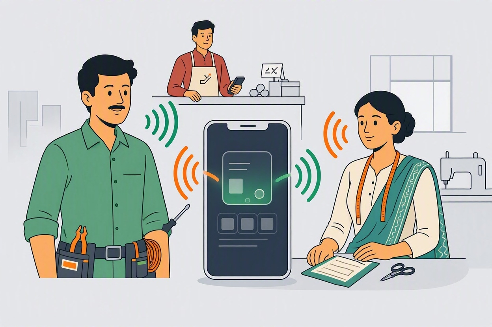
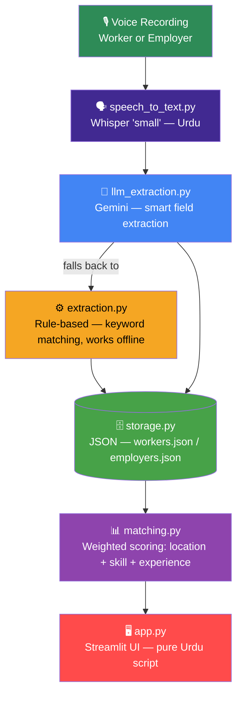

<div align="center">

# 🎙️ Rozgar AI

### *Voice-First Job Marketplace for Pakistan's Informal Workforce*


<br>

**ہر آواز ایک ہنر، ہر ہنر کو روزگار**

<br>

[](https://www.python.org/)
[](https://streamlit.io/)
[](https://ai.google.dev/)
[](https://github.com/openai/whisper)
[](LICENSE)

<br>




</div>

<br>

---

## 📖 Table of Contents

<table>
<tr>
<td width="50%" valign="top">

- [📌 Overview](#-overview)
- [🧩 The Problem](#-the-problem)
- [✨ Key Features](#-key-features)
- [🏗️ System Architecture](#️-system-architecture)
- [👷 Worker Categories](#-worker-categories)

</td>
<td width="50%" valign="top">

- [🧠 Matching Engine](#-matching-engine)
- [🗂️ Project Structure](#️-project-structure)
- [🚀 Quick Start](#-how-to-run-locally)
- [🗺️ Roadmap](#️-roadmap)
- [🏆 About the Hackathon](#-about-the-hackathon)

</td>
</tr>
</table>

---

<br>

## 📌 Overview

> **Rozgar AI** is a fully voice-driven job marketplace built for Pakistan's informal workforce — electricians, tailors, security guards, drivers, domestic helpers, and millions like them who are often locked out of digital job platforms because those platforms assume typing, English, and a CV.

<div align="center">

### 🎙️ *Bol kar profile banti hai. Bol kar job milti hai. Bas itna hi.* 🎙️

</div>

<br>

## 🧩 The Problem

Pakistan's informal sector employs **tens of millions of skilled workers**, yet almost every job platform is built for a white-collar, English-typing user. A tailor in Korangi or a security guard in Malir doesn't need a resume builder — they need to **speak once** and be found by the right employer nearby.

Rozgar AI removes every barrier between a skill and a job: no forms, no CV, no English, no literacy requirement — just a voice recording.

<br>

## ✨ Key Features

<table>
<tr>
<td align="center" width="25%">🎙️<br><b>Voice-Only Onboarding</b><br><sub>Record or upload, no typing at all</sub></td>
<td align="center" width="25%">🧠<br><b>Dual Extraction Engine</b><br><sub>Gemini (smart) with rule-based offline fallback</sub></td>
<td align="center" width="25%">📍<br><b>Location-Aware Matching</b><br><sub>Karachi's 7 official districts, no GPS needed</sub></td>
<td align="center" width="25%">🕌<br><b>Pure Urdu Interface</b><br><sub>Every label, button, and tab — Urdu script</sub></td>
</tr>
<tr>
<td align="center" width="25%">⚖️<br><b>Category-Aware Scoring</b><br><sub>Different weight profiles per job type</sub></td>
<td align="center" width="25%">✏️<br><b>Editable Profile Cards</b><br><sub>Fix one misheard word, no full re-record</sub></td>
<td align="center" width="25%">🔒<br><b>Privacy by Default</b><br><sub>Phone numbers masked, reveal-on-click</sub></td>
<td align="center" width="25%">💰<br><b>Honest Rate Display</b><br><sub>Free-text pay info — never forced into a number</sub></td>
</tr>
</table>

<br>

## 🏗️ System Architecture



> 💡 If Gemini is unreachable (no internet, quota, or API error), the system falls back to a **fully offline, rule-based extraction pipeline** — the app never breaks just because the network dropped.

<br>

## 👷 Worker Categories

<div align="center">

| Category | Roles Covered | Matching Priority |
|:---|:---|:---:|
| 🔧 **Tradesman** | Electrician, AC Technician, Plumber, Auto Mechanic, Carpenter, Painter, Welder | Skill > Location > Experience |
| 🧵 **Home-Based (Women)** | Tailoring / Darzan, Home Tutor, Embroidery / Kasheeda, Cook / Chef | Location > Skill |
| 👥 **Bulk Staffing** | Security Guard, Construction Labour, Domestic Helper, Driver, Loader, Gardener, Cleaner, Delivery Boy | Skill + Experience > Location |

</div>

<br>

## 🧠 Matching Engine

Rozgar AI doesn't just keyword-match — it runs a **weighted, category-aware scoring formula** per job:

```
Final Score = (Location Score × W_location) + (Skill Score × W_skill) + (Experience Score × W_experience)
```

<details open>
<summary><b>📦 Click to expand scoring logic</b></summary>

<br>

**Location Proximity** *(locations.py — Karachi's 7 official districts, no GPS/maps API needed)*

```
same area           → 1.0
same district        → 0.6
different district    → 0.3
either area unknown    → 0.3   (neutral — doesn't punish missing data)
```

**Skill Score** *(tiered, not raw embedding similarity — prevents unrelated trades scoring high just from similar phrasing)*

```
exact skill match                    → 1.0
same category, different skill        → embedding score, capped at 0.5
different category entirely            → embedding score, capped at 0.25
```

Powered by a multilingual sentence-transformer (`paraphrase-multilingual-MiniLM-L12-v2`) — so a worker's Urdu description and Roman Urdu phrasing of the same skill still score highly against each other.

**Experience Score**

```
0 years difference     → 1.0
1–2 years difference    → 0.8
3–5 years difference     → 0.5
6+ years difference       → 0.2
```

**Category Weight Profiles**

| Category | Location | Skill | Experience |
|:---|:---:|:---:|:---:|
| Tradesman | 0.3 | 0.5 | 0.2 |
| Home-Based (Women) | 0.6 | 0.4 | 0.0 |
| Bulk Staffing | 0.2 | 0.5 | 0.3 |

Below a score of **0.4**, a result is honestly flagged as `is_weak_match` — shown as *"closest available, not an exact match"* rather than presented with false confidence. The engine never returns zero results; it always ranks and shows the best available.

</details>

<br>

## 🗂️ Project Structure

```
Rozgar-AI/
│
├── 🎙️ speech_to_text.py        # Whisper "small" model — Urdu transcription
├── 🧠 llm_extraction.py         # Gemini-powered smart field extraction
├── ⚙️ extraction.py             # Rule-based fallback (works fully offline)
├── 🗺️ locations.py              # Karachi district/area proximity logic
├── 🗄️ storage.py                # JSON read/write — workers.json, employers.json
├── 📊 matching.py               # Weighted, category-aware matching engine
├── 🖥️ app.py                    # Streamlit UI (pure Urdu script)
├── 🌱 generate_seed_data.py     # Demo data generator (4-district scope)
│
├── 🔊 src/tts.py                # Text-to-speech listing playback
├── 🔳 src/qr_util.py            # QR code generator for printable flyers
│
├── 📁 data/
│   ├── workers.json
│   └── employers.json
│
├── 🖼️ assets/
│   └── Background.png           # README hero illustration
│
├── .env.example                 # Template — copy to .env and add your Gemini key
├── .gitignore
├── requirements.txt
└── README.md
```

<br>

## 🚀 How to Run Locally

<details open>
<summary><b>📋 Prerequisites</b></summary>
<br>

- Python 3.10+
- `ffmpeg` installed (required by Whisper)
- A free [Google Gemini API key](https://ai.google.dev/)

</details>

<br>

**1️⃣ Clone the repo**

```bash
git clone https://github.com/abrarghoury/Rozgar-AI.git
cd Rozgar-AI
```

**2️⃣ Create a virtual environment**

```bash
python -m venv venv
venv\Scripts\activate        # Windows
source venv/bin/activate     # Mac/Linux
```

**3️⃣ Install dependencies**

```bash
pip install -r requirements.txt
```

**4️⃣ Configure environment variables** — copy `.env.example` to `.env` and add your key:

```env
GEMINI_API_KEY=your_key_here
```

**5️⃣ (Optional) Generate demo data**

```bash
python generate_seed_data.py
```

**6️⃣ Launch the app**

```bash
streamlit run app.py
```

<br>

## 🗺️ Roadmap

- [x] Voice recording + Whisper transcription (Urdu)
- [x] Dual extraction — Gemini with offline rule-based fallback
- [x] Weighted, category-aware matching engine
- [x] Editable profile cards + masked phone numbers
- [x] Pure Urdu-script interface
- [ ] Apply / Save / Call / WhatsApp action buttons
- [ ] "Turant Chahiye" urgent badge + applicant counter
- [ ] Text-to-speech "Suniye" listing playback
- [ ] QR code printable flyers for offline reach
- [ ] Related-skills scoring tier (e.g. Electrician ↔ AC Technician)
- [ ] Multi-city expansion beyond Karachi

<br>

## 🏆 About the Hackathon

<div align="center">

Built for the **Alibaba Cloud AI Hackathon 2026**, in partnership with **Bano Qabil** and the **Alkhidmat Foundation** — with a mission to bring practical, accessible AI tooling to Pakistan's underserved communities.

</div>

<br>

## 🤝 Contributing

Contributions, issues, and feature requests are welcome! Feel free to check the [issues page](https://github.com/abrarghoury/Rozgar-AI/issues) or open a pull request.

<br>

---

## 📬 Contact

<div align="center">

**Abrar Shakeel Ghoury**

[](mailto:abrarshakeel21@gmail.com)
[](https://www.linkedin.com/in/abrar-ghoury/)
[](https://github.com/abrarghoury)

<br>

*Built with ❤️ using Python, OpenAI Whisper, Google Gemini, and Streamlit*

**⭐ Agar ye project pasand aaye to repo ko star zaroor karein! ⭐**

</div>